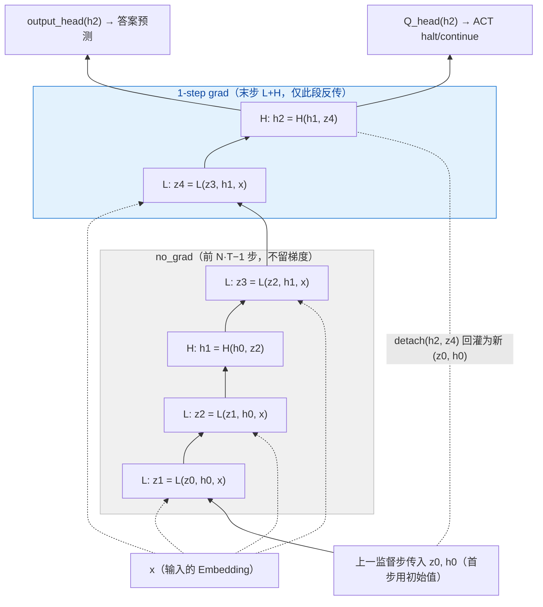
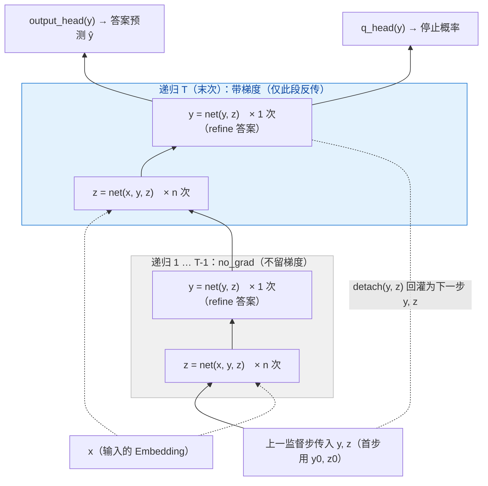
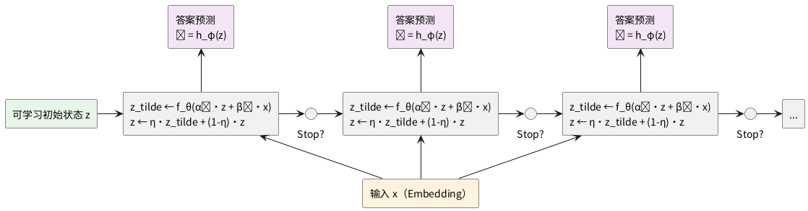

# 小模型隐式推理：从 HRM 到 TRM 再到 FPRM 的技术演进

---

## 一、问题领域与现状

> 相关论文：
> - [HRM: Hierarchical Reasoning Model](https://arxiv.org/abs/2506.21734v3)
> - [TRM: Tiny Recursive Model](https://arxiv.org/abs/2510.04871v1)
> - [FPRM: Fixed-Point Reasoning Model](https://arxiv.org/abs/2606.18206v1)

### 1.1 领域定位

这三篇论文均聚焦于 **AI 组合推理（Compositional Reasoning）**，核心任务是解决需要**多步逻辑推演**的复杂问题。典型任务包括数独（Sudoku）、迷宫求解（Maze）、状态追踪（State Tracking）以及 ARC-AGI 等抽象推理基准。这些任务的共同特点是：答案无法通过单步模式匹配直接得出，而是需要模型在内部进行一系列隐式的逻辑推导——类似于人类在草稿纸上反复演算、逐步修正的过程。

### 1.2 核心挑战

当前主流范式面临三重困境：

**第一，LLM + Chain-of-Thought（CoT）**。虽然通过显式生成中间步骤提升了推理能力，但存在任务分解脆弱、数据需求巨大、推理延迟高等问题。更重要的是，CoT 的每一步都暴露在语言空间中，容易积累错误，且对于需要上百步精确逻辑推导的任务（如极端数独），长思维链的可靠性急剧下降。

**第二，标准深度前馈网络**。固定深度的网络缺乏"按需计算"的能力——简单问题和困难问题消耗相同的计算量。对于组合推理任务，浅层网络无法表达足够的逻辑深度，而深层网络又面临训练困难。

**第三，深层循环网络的信号传播问题**。理论上，循环复用单个网络块可以获得任意计算深度。但反向传播时，损失对初始状态的梯度需要经过 Jacobian 矩阵的连乘：

$$\frac{\partial \mathcal{L}}{\partial h_0} = \frac{\partial \mathcal{L}}{\partial h_T} \cdot \prod_{t=0}^{T-1} J_t$$

如果每层 Jacobian 的谱范数 $\|J_t\|_2 \approx \lambda$，则梯度幅度约为 $\lambda^T$。当有效深度 $T$ 很大（如 100+）时，即使 $\lambda$ 只略微偏离 1，$\lambda^T$ 也会指数级衰减或爆炸。这就是深层循环网络几乎不可训练的根本原因。

### 1.3 核心矛盾

组合推理需要**深度计算**（更多的迭代步骤），但深层网络存在**梯度崩溃**。如何用极小的神经网络（数百万参数）实现稳定、自适应深度的隐式推理，替代庞大的 LLM + CoT 范式，是这三篇论文共同瞄准的方向。

---

## 二、三篇论文详解

### 2.1 HRM：Hierarchical Reasoning Model

#### 2.1.1 研究思路

HRM 的出发点是**仿生**。作者认为，人类大脑处理复杂推理时并非"单层循环"，而是存在明显的分层结构：前额叶皮层负责慢速的抽象规划，而感觉运动皮层负责快速的细节计算。这种"多时间尺度"的分层处理可能是深度推理的关键。

基于这一直觉，HRM 提出了一种**双网络架构**：高层模块负责宏观规划，低层模块负责微观计算。低层在固定高层状态下反复迭代达到局部平衡（不动点），然后高层前进一步，低层随即重置进入新的计算阶段。这种"分层收敛"机制被假设为模拟人类"先想局部、再想全局"的推理节奏。

#### 2.1.2 模型结构与前向过程

**模型结构**

HRM 的核心由两个相互依赖的循环模块组成：

**高层模块 $H$**：慢速更新，负责抽象规划。输入为当前高层状态 $h_t$ 和低层最新隐状态 $z$，输出为下一高层状态 $h_{t+1}$。注意高层**不直接接收输入** $x$，它只通过低层汇总的 $z$ 间接感知题目。

**低层模块 $L$**：快速更新，负责细节计算。输入为当前低层状态 $z_i$、高层状态 $h_t$ 和**输入** $x$，输出为下一低层状态 $z_{i+1}$。$x$ 馈入**每一次**低层更新，相当于把题目约束反复提供给细节计算。

下图以默认的 $N=2, T=2$ 为例，给出两个模块的连接方式与完整数据流：



读图要点：
- **$x$ 注入每个 L 步**：嵌入后的输入 $x$ 作为条件馈入**每一次低层更新** `L(·,·,x)`（虚线箭头）；而高层 `H(·,·)` **不接 $x$**——高层只看低层汇总的 $z$，不直接看题目。
- **$L$ 链** 是低层快循环（细节计算），**$H$** 是高层慢更新（宏观规划），每满 $T$ 步触发一次。共 $N\cdot T=4$ 个低层步、$N=2$ 个高层步。
- **一步梯度近似**：前 $N\cdot T-1$ 步（z1~z3、h1）都在 no_grad 内；只有最后一对 `z4 = L(...)`、`h2 = H(...)` 被提到 `# 1-step grad`，作为唯一带梯度的步骤。
- **多监督步循环**：本图画的是**一个监督步**(`hrm` 的一次调用)。末态 $(h_2, z_4)$ 经 `detach` 后**带入下一监督步**作为新的 $(h_0, z_0)$（虚线回环）。

**前向过程**

对照上图，一次监督步内的数据流可分三步：

1. **初始化**：$x$ 为题目嵌入后的表示（沿用论文记号，下文 $x$ 均指嵌入结果）；高层状态 $h_0$、低层状态 $z_0$ 来自上一监督步（首步用初始值）。

2. **宏观循环（共 $N$ 个高层周期，每周期 $T$ 个低层步）**：低层在固定高层状态下连续迭代 $T$ 步（每步都注入 $x$），每跑满 $T$ 步高层前进一次。即图中 `L` 链每 $T$ 步触发一次 `H` 更新。

3. **输出**：循环结束后，基于最终高层状态 $h$，通过 `output_head` 输出答案预测、`Q_head` 输出 ACT 用的 Q 值。

这种结构的特点是：**高层每前进一步，低层就连续迭代 $T$ 步**。其关键并不在于巨大的循环深度，而在于下面要讲的梯度近似让深层循环变得可训练。

#### 2.1.3 一步梯度近似的理论依据

HRM 面临的最大训练挑战是：循环若展开多步进行反向传播，梯度需要经过多个 Jacobian 的连乘，必然崩溃。

HRM 的实际解决方案是**一步梯度近似（1-step gradient approximation）**，而非真正去计算矩阵求逆。从上一节的图中可以清楚看到：整段宏观循环被包在 `torch.no_grad()` 中，**不留梯度**；只有循环结束后额外执行的最后一次 $L$ 和 $H$ 更新才进入计算图：

```python
with torch.no_grad():            # 前 N*T-1 步：无梯度
    for _i in range(N*T - 1):
        zL = L_net(zL, zH, x)
        if (_i+1) % T == 0:
            zH = H_net(zH, zL)
# 1-step grad                     # 仅最后一步带梯度
zL = L_net(zL, zH, x)
zH = H_net(zH, zL)
```

**这一近似的理论依据是深度均衡（DEQ）/ 隐函数定理（IFT）**。把循环模块视为求解不动点 $z^* = F(z^*, \theta)$，由 IFT 可得**精确**梯度：

$$\frac{\partial z^*}{\partial \theta} = \left(I - J_F\right)^{-1} \frac{\partial F}{\partial \theta}\bigg|_{z^*}, \qquad J_F = \frac{\partial F}{\partial z}\bigg|_{z^*}$$

它无需展开循环，但要对 $(I-J_F)$ 求逆，论文指出代价太高、**并不采用**。HRM 转而将逆矩阵 $(I-J_F)^{-1}=I+J_F+J_F^2+\cdots$ 展开，**只保留首项**，即 $(I-J_F)^{-1}\approx I$，于是梯度退化为只对最后一步求导。可见，其严格成立的前提是高阶项 $J_F^k\,(k\ge1)$ 可忽略，即模块**真的收敛到不动点**且 $J_F$ 谱范数足够小——而 $N=T=2$ 的固定步数未必满足，这正是后续 FPRM 的质疑切入点（见 2.3）。

#### 2.1.4 基于 ACT 的提前停止

此外，HRM 使用**自适应计算时间（ACT）**机制决定何时停止外层监督循环：`Q_head` 额外输出 halt / continue 两个 Q 值（`q[0]`、`q[1]`），通过 Q-learning 风格的损失（`ACT_halt` / `ACT_continue`）训练，推理时当 `q[0] > q[1]` 即提前停止，从而根据问题难度自适应分配计算量。

#### 2.1.5 实验效果

HRM 使用 **27M 参数**，仅需约 **1000 个样本** 进行训练，在 Sudoku-Extreme 上达到 55.0%，Maze-Hard 上达到 74.5%，ARC-AGI-1 上达到 40.3%。作为对比，同规模的直接预测模型和 LLM + CoT 在这些任务上几乎为 0%：

- **Sudoku-Extreme**：极端难度数独
- **Maze-Hard**：复杂迷宫求解
- **ARC-AGI**：抽象推理语料库

这是首次有研究证明：小模型 + 隐式递归可以在复杂推理任务上击败大模型 + CoT 范式。然而，HRM 的结构复杂（双网络、多时间尺度、生物学类比重，ACT 还需 Q-learning），且其一步梯度近似的合理性依赖"低层确实收敛到不动点"这一前提——后续工作正是从简化结构与放松该前提两个方向继续推进。

---

### 2.2 TRM：Tiny Recursive Model

#### 2.2.1 研究思路

TRM 的核心问题是：**HRM 的层级结构是否真的是成功的关键？** 作者质疑，HRM 的双网络设计带有较强的生物学色彩，可能并非最优。他们提出一个更激进的假设：**递归迭代本身才是核心，层级可能是不必要的。**

基于这一假设，TRM 尝试用**极简的单网络**替代 HRM 的双网络，验证"递归修正答案"是否足够。如果成功，意味着可以用更简单的架构、更少的参数达到甚至超越 HRM 的效果。

#### 2.2.2 模型结构与前向过程

**模型结构**

TRM 的架构极为简洁：**一个仅 2 层的微型网络 $f_\theta$**（带注意力的 TRM-Att 约 7M 参数，纯 MLP 版 TRM-MLP 更小）。论文特别发现：**层数更少反而泛化更好**（2 层优于 4 层），与"小模型靠递归深度而非参数堆叠"的主旨一致。该网络通过输入中是否包含原始输入 $x$ 来自动切换"推理模式"和"答案更新模式"。

TRM 维护三个核心状态（对应 2.1 中 HRM 的高层 $h$ 与低层 $z$，TRM 把它们重新诠释为）：
- **$x$**：输入的 Embedding（独立可学习参数）
- **$y$**：当前对答案的预测（对应 2.1 的高层状态 $h$，直接代表一份解，如填好的数独格子）
- **$z$**：隐式推理特征（对应 2.1 的低层状态 $z$，不直接对应解的"中间笔记"）

> 符号对照：HRM 原论文用 $z_H/z_L$ 记高/低层状态；本文 2.1 节为直观改记作 $h/z$。TRM 沿用同一对状态，但把高层 $h$ 改名为 $y$（强调它就是"答案"）、低层仍记 $z$。

整个模型是**三层嵌套循环**：
- 最外层是深度监督循环
- 中间层是单个监督步内的 $T$ 次"递归"，
- 最内层是一次递归内**先更新 $z$ 共 $n$ 次、最后更新 $y$ 一次**。

下图给出了**单个监督步骤**的内部结构（即中间层 + 最内层）：



读图要点：
- **与 HRM 图对照**：把 HRM 的"高层 $h$ / 低层 $z$"换成"答案 $y$ / 推理 $z$"，把 HRM 的"双网络 $L,H$"换成**同一个 `net`**——靠输入是否含 $x$ 切换角色。
- **每次递归内**：先 $z = \text{net}(x, y, z)$ 连跑 $n$ 次（含 $x$，"推理模式"），最后 $y = \text{net}(y, z)$ 一次（不含 $x$，"答案模式"）。
- **梯度边界**：前 $T-1$ 次递归在灰色 `no_grad` 区；只有蓝色的**末次递归**反传，穿过其内部 $n+1$ 步。监督步之间 `detach`，梯度不跨步。
- **顶部双头**：`output_head` 出答案、`q_head` 出停止概率（只判断"是否已答对"，无 continue 损失、无额外前向）。

**前向过程**

对照上图，按三层循环从外到内来看：

**最外层：深度监督步骤**——最多执行 $N_{sup} = 16$ 步，每步基于当前 $y$ 输出预测并算损失，末态 $(y,z)$ 经 `detach` 传入下一步。

**中间层：$T$ 次递归**——每个监督步骤内，把一次"递归"连续调用 $T$ 次（默认 $T=3$）。其中**前 $T-1$ 次在 `torch.no_grad()` 下运行（不留梯度），仅最后 1 次带梯度**（即图中灰色与蓝色子图的区别）。

**最内层：一次递归内的 $n+1$ 步**——这正是论文的 `latent_recursion`，顺序是**先更新 $z$ 共 $n$ 次，最后更新 $y$ 一次**：

```python
def latent_recursion(x, y, z, n=6):
    for i in range(n):       # L-phase：隐式推理，先更新 z（n 次）
        z = net(x, y, z)     #   输入含 x → "推理模式"
    y = net(y, z)            # H-phase：再用 z 修正答案 y（1 次）
    return y, z              #   输入不含 x → "答案模式"
```

把三层循环合起来，**完整前向过程**为：

```python
# 默认 N_sup=16, T=3, n=6
for s in range(N_sup):                     # 最外层：深度监督步骤
    with torch.no_grad():
        for j in range(T-1):               # 中间层：前 T-1 次递归，不留梯度
            y, z = latent_recursion(x, y, z, n)   # 最内层：n 次 z + 1 次 y
    y, z = latent_recursion(x, y, z, n)    # 中间层：末次递归，带梯度（仅此段反传）
    # 基于 y 输出预测、算损失、反传
    y, z = y.detach(), z.detach()          # 携带状态、断梯度，传入下一监督步
```

**ACT 停止机制**：

TRM 大幅简化了 HRM 的 ACT。每个监督步骤额外输出一个 halting probability（停止概率），仅用**二元交叉熵**训练"当前 $y$ 是否已等于正确答案"：
- 若当前 $y$ 已等于正确答案 → 应停止
- 否则 → 应继续

关键是 TRM **去掉了 HRM 的 continue 损失**，从而**省去了 HRM 为计算 Q 值所需的那次额外前向**，更省算力。这样模型仍能按难度自适应分配计算量：简单题目几步即停，困难题目用满 16 步。

#### 2.2.3 反向过程

TRM 放弃了 HRM 的**一步梯度近似**：在带梯度的那一段递归内，它**完整反传穿过全部 $n+1$ 步**（不再像 HRM 那样只取最后 1 步、丢掉中间链）。论文明确这一改动的收益：放弃一步梯度、改为对末段递归完整反传，**直接把 Sudoku-Extreme 从 56.5% 提升到 87.4%**——这也是 TRM "去层级、留递归"假设的核心证据：既然不再依赖 IFT，就**不需要假设达到了不动点**。

**深度监督的损失形式与 HRM 相同**（TRM 直接继承自 HRM）：并**不是**把各步损失累加成一个总和再统一反传一次，而是**每个监督步各自算一次损失、各自 `backward` + `opt.step` 更新参数**。

若把各步损失记作 $\mathcal{L}_s$，训练在概念上等价于优化：

$$\mathcal{L} = \sum_{s=1}^{N_{sup}} \mathcal{L}_s(y^{(s)}, y_{true})$$

但要注意这只是**概念上的求和**——由于每步 `detach` 且立即 `opt.step`，实际是逐步独立优化，并非对一个静态总和做单次反传。

每个 $\mathcal{L}_s$ 都要求第 $s$ 步的中间状态能输出合理的答案。这意味着模型被训练成：**即使只循环了部分步骤，当前的 $y$ 也要能给出合理的预测；随着循环继续，答案应该越来越好。**

#### 2.2.4 为什么有效（原理分析）

TRM 的有效性来自几个关键设计：

**权重共享的强归纳偏置**：同一个 $f_\theta$ 被反复调用，施加了一个极强的约束——每次循环必须做"同一种类型的推理操作"。这迫使模型学习一种**一致的、单调改进的迭代规则**，类似于经典迭代算法（如梯度下降）的哲学。

**深度监督切分梯度链 + 末次完整反传**：TRM 不再用 IFT 近似，而是对**每个监督步骤的最后一次递归做完整反传**（穿过其 $n+1$ 步），同时靠 `detach` 把监督步之间切开。如果没有梯度切分，梯度需要从最终输出一路回传经过全部 $N_{sup} \times T \times (n+1)$ 层；而梯度切分将全局长链切分为多个短链——每段只回传一次递归的 $(n+1)$ 层。数学上，这相当于将：

$$\prod_{t=1}^{N_{sup}\cdot T\cdot(n+1)} J_t \quad \text{（单链，指数灾难）}$$

替换为多个短链之和，每个短链只有 $(n+1)$ 个 Jacobian 相乘，衰减可控。

**输入 $x$ 的"开关"机制**：通过是否在输入中包含 $x$，同一个网络自动切换"推理模式"（更新 $z$）和"答案模式"（更新 $y$）。这比 HRM 的双网络更简洁，且避免了两个网络之间的协调问题。

**EMA 稳定小数据训练**：在仅约 1000 样本的数据上，对权重做指数滑动平均（衰减 0.999）显著抑制过拟合。论文消融显示其贡献可观（79.9% → 87.4%），是极小模型/极小数据下能稳定泛化的重要保障。

#### 2.2.5 实验效果

TRM 以**仅 7M 参数**（带注意力版，不到 HRM 的 1/4；纯 MLP 版更小）刷新了一批基准。注意不同任务的最优变体不同：

- **ARC-AGI-1**：**44.6%**（TRM-Att）
- **ARC-AGI-2**：**7.8%**（TRM-Att）
- **Maze-Hard**：**85.3%**（TRM-Att）
- **Sudoku-Extreme**：**87.4%**（TRM-MLP，纯 MLP 在该任务上反而更好）

其中 ARC-AGI 的成绩**超越了 DeepSeek R1、o3-mini、Gemini 2.5 Pro 等巨型 LLM**，而 TRM 的参数量不到后者的 0.01%。论文还报告了一个反直觉的现象：在 Sudoku 上**纯 MLP（去掉自注意力）反而比带注意力更好**（约 +10%），但该替换在其他任务上表现不佳——说明架构选择与任务结构强相关。

然而，FPRM 的后续分析揭示了循环架构成功的更深层原因： “分层推理”只是表象，信号传播瓶颈才是根本原因。FPRM 的消融实验表明，**减少内层深度 $n$、增加外层监督步骤数**，TRM 性能反而提升——这说明 TRM 的嵌套结构本质上是在 workaround 信号传播问题，而非提供了独特的分层推理能力。

---

### 2.3 FPRM：Fixed-Point Reasoning Model

#### 2.3.1 研究思路

FPRM 的核心问题是：**循环架构（包括 HRM 和 TRM）的成功，到底是因为"层级/嵌套结构"本身，还是因为层级无意中改善了信号传播？**

FPRM 提出一个关键假设：HRM 和 TRM 都基于 **post-norm Transformer**。Post-norm 虽然能限制激活幅度，但已被证明在深层网络中引入严重的信号传播问题。层级结构（HRM 的 H/L 分层、TRM 的嵌套监督）可能并非提供了独特的"分层推理能力"，而是通过**限制单次循环深度、分解计算图**等方式，无意中缓解了 post-norm 的梯度崩溃问题。

基于这一假设，FPRM 直接修复 post-norm 的信号传播缺陷，验证了**非层级扁平循环**能否达到甚至超越层级基线。

#### 2.3.2 模型结构与前向过程

**模型结构**

FPRM 采用**经典循环架构（Classic Looped Architecture）**：一个共享权重的 Transformer 块被反复调用，直到隐状态达到不动点。

FPRM 的前向过程可以用如下代码表示：
```
z = z_0                                   # 可学习初始隐状态
while not converged:                      # 直到不动点收敛
    z_tilde = f_θ(z; x)                   # 同一个块复用（内含 pre-norm + 残差缩放）
    z = η * z_tilde + (1 - η) * z         # 阻尼更新（η 为步长）
    r = ||z - z_tilde||∞ / (||z_tilde||∞ + ε)   # 相对残差
    if r < τ:                             # 不动点收敛
        break
y = h_φ(z)                                # 从收敛状态解码答案
```

展开循环，如下图：



读图要点：
- **RNN 模式**：隐藏状态 $z$ 从左到右横向传递，每个共享权重的 $f_\theta$ 块水平排列。
- **不动点即停止**：每个步骤，检测相对残差 $r$，足够小则结束循环；否则继续。自然实现了按难度自适应的计算深度。
- **阻尼更新**：$\eta$ 是的阻尼步长，负责让收敛路径平稳

核心组件：
- **$f_\theta$**：单个 Transformer 块（Pre-norm + 残差缩放），所有循环步骤共享权重，内部结构如下图。
- **$h_\phi$**：预测头，从收敛的隐状态解码最终答案
- **$z_0$**：可学习的初始隐状态


其中 $\alpha_1, \alpha_2$ 可学习。缩放把激活幅度重新拉回有界，于是 pre-norm 的信号传播优势得以保留、又不发散。更关键的是：当 $\alpha_2 \lambda_f < 1$（$\lambda_f$ 为块的 Lipschitz 常数）时，$f_\theta$ 成为**压缩映射**，迭代必然收敛到唯一不动点——这是后面"不动点停止"能成立的数学保证。

#### 2.3.3 学习过程

FPRM 的训练采用**截断 BPTT（Truncated BPTT）+ 深度监督**：

```
z = z_0
while FPOpt.cont():              # 外层：直到不动点收敛
    for k = 1, ..., K:           # 内层：一个 BPTT 窗口（带梯度，深度 K）
        z_tilde = f_θ(z; x)
        z = FPOpt.step(z, z_tilde)   # 阻尼更新 + 残差监控
    y_hat = h_φ(z)               # 窗口末尾输出预测
    loss = CrossEntropy(y_hat, y)
    ModelOpt.backward(loss)      # 仅在本窗口 K 步内反传
    z = detach(z)                # 截断梯度，进入下一窗口
```

**关键细节**：
- **截断 BPTT（K 步）**：梯度只在窗口内的 $K$ 步回传，$K$ 远小于总循环次数，从根上避免长链 Jacobian 连乘。
- **深度监督**：每个窗口末尾都算一次损失，逼模型学到"即使只迭代了 $K$ 步，当前 $z$ 也要能给出合理答案"——这正是不动点能与正确答案对齐的训练压力来源。
- **detach(z)**：每窗口结束切断梯度，窗口之间独立优化，外层 while 不会无限回传。

**与 HRM/TRM 的梯度策略对比**——三者都靠"切断长链"避免梯度崩溃，但切法不同：

| | 带梯度的范围 | 依赖的假设 |
|---|---|---|
| HRM | 仅最后 1 步（1-step grad） | 需收敛到不动点（IFT 一阶近似） |
| TRM | 仅末次递归的 $n+1$ 步 | 不需要不动点假设 |
| FPRM | 每个 $K$ 步窗口都反传 | 不需要不动点假设；靠模型本身稳定收敛到不动点 |

#### 2.3.4 基于不动点收敛的提前停止

与 HRM 的 ACT（需 Q-learning）、TRM 的 halting probability（需 BCE）都不同，FPRM **不引入任何额外的停止头或停止损失**，而是直接用迭代本身的**相对残差**判断是否收敛：

$$r_i = \frac{\|z_i - f_\theta(z_i; x)\|_\infty}{\|f_\theta(z_i; x)\|_\infty + \epsilon} < \tau$$

当残差足够小，说明再迭代也不会改变 $z$，即"想明白了"，停止循环。这带来真正的**自适应计算**：简单题早收敛、循环少；难题晚收敛、循环多。

**阻尼机制**：朴素迭代可能在不动点附近**振荡**（$z$ 在两个值之间来回跳，残差不下降）。FPRM 用**阻尼更新** $z \leftarrow \eta\, z_{\tilde{}} + (1-\eta)\, z$，并配一个 patience 机制：若连续 $P$ 步残差不再下降，就按 $\eta \leftarrow \gamma\eta\ (\gamma<1)$ 几何衰减步长，强行压住振荡、保证收敛路径单调干净。

#### 2.3.5 为什么有效（原理分析）

FPRM 的有效性来自四个层面的联合作用：

**直接修复 Jacobian（架构层面）**

Pre-norm + 残差缩放使得每层 Transformer 的 Jacobian 谱范数 $\|J_t\|_2$ 更接近 1 且稳定有界。因此即使长链 $\prod_{t=1}^T J_t$ 中 $T$ 很大（如 1000），也不会指数衰减或爆炸。这是 FPRM 能够使用扁平循环（而非层级分解）的根本保障。

**隐式惩罚机制（训练动态层面）**

FPRM 没有显式惩罚"未收敛"，但深度监督 + 交叉熵损失的组合会**隐式惩罚**这种情况：

假设在第 $m$ 个窗口已经输出了正确答案，但循环尚未收敛（$\|z_{t+1} - z_t\| > \epsilon$）：
- 窗口 $m+1$ 继续更新 $z$ → 可能把正确答案改错 → 损失 $\mathcal{L}_{m+1} \gg 0$
- 或者即使类别没变，概率分布变模糊（置信度下降）→ 交叉熵损失增加

经过多次训练迭代后，$f_\theta$ 学会：**"如果当前状态已经能输出正确答案，就不要再做大更新。"** 最终演化出的行为是：在正确答案附近输出接近零的更新，即趋向不动点。

**预测头的解码学习（表示层面）**

$h_\phi$ 是一个独立的预测网络，它在训练过程中学会了如何从收敛的分布式表示 $z^*$ 中提取结构化输出。即使 $z^*$ 本身不是人类可读的"数独盘面"，$h_\phi$ 也学会了哪些维度对应答案的哪些部分。

**收敛引导（优化层面）**

阻尼机制保收敛路径是"干净"的——$z$ 稳定地朝一个方向演化，直到饱和。这使得训练更容易建立"不动点 ↔ 正确答案"的稳定关联，避免在解附近振荡导致的梯度混乱。

#### 2.3.6 实验效果

FPRM 使用 **约 7M 参数**（与 TRM 相近），扁平循环在多个任务上**全面达到或超越** HRM（27M）与 TRM（7M）：

| 任务 | FPRM (7M) | TRM (7M) | HRM (27M) |
|---|---|---|---|
| **Sudoku-Extreme** | **94.2%** | 74.7% | 55.0% |
| **Maze-Hard** | **87.0%** | 85.3% | 74.5% |
| **ARC-AGI-1** (Pass@2) | **47.5%** | 44.6% | 40.3% |
| **ARC-AGI-2** (Pass@2) | 6.2% | 7.8% | 5.0% |

> 在 **State-tracking**（序列长度 128）上差距尤为悬殊：FPRM 在 $A_5$ 上达 **98.1%**、$S_5$ 上达 **98.8%**，而带 ACT 的 TRM 变体在 $A_5$ 上仅 **65.3%**——扁平深循环在需要长程状态追踪的任务上优势明显。

> 注：本表 TRM 的 Sudoku-Extreme 为 74.7%，与 2.2.5 中 TRM 原论文报告的 87.4%（TRM-MLP）不同——这是 FPRM 论文在统一设置下复现的结果，跨论文的数值口径不完全一致，对比时以**同一张表内**的横向比较为准。

---

## 三、演进关系与核心结论

这三篇论文构成了一个清晰的**技术演进链条**：

**HRM（2025.06）是奠基者**。它首次用"仿生分层"打开了小模型隐式推理的大门，证明了 27M 参数的小模型可以在复杂推理任务上击败大模型 CoT。但其设计带有较强的生物学色彩、结构复杂（双网络 + ACT 的 Q-learning），且训练依赖一步梯度近似（其严格成立需要低层确实收敛到不动点的假设）。

TRM（2025.10）通过消融实验**质疑了层级必要性**，将核心机制提炼为"递归修正答案"，用 7M 参数的极简单网络超越了 HRM。但它保留了嵌套结构（L-phase/H-phase）作为 post-norm 信号传播问题的 workaround。

FPRM（2026.06）指出 TRM/HRM 的成功可能源于**层级无意中改善了信号传播**，直接修复 post-norm 的缺陷（pre-norm + 残差缩放），用极简的扁平循环 + 不动点收敛实现了超越。

**核心结论**：

1. **复杂推理的关键不在于参数规模，而在于能否在隐状态空间中进行足够深、足够稳定的迭代计算。** 三篇论文共同挑战了"大模型 + 长思维链"的主流范式。

2. **层级结构的价值是"分解深度"而非"分层推理"。** HRM 用一步梯度近似（IFT 的一阶近似）把梯度只回传最后一步，TRM 的深度监督将长链切分为短链之和——两者都在数学上降低了最大梯度传播深度。FPRM 证明，如果直接修复梯度塌陷本身，就不需要这种分解。

3. **"不动点 = 推理饱和"是自适应计算的自然终点。** FPRM 的训练动态通过"后续循环可能改错/降低置信度"隐式惩罚未收敛状态，迫使模型演化出"渐进改进直至稳定"的迭代规则——这与经典迭代算法（梯度下降、信念传播、PageRank）的哲学一致。

4. **从 27M 到 7M，从双网络到单块，从仿生到原理——这个方向展示了"做减法"的力量。** 当架构足够简洁、归纳偏置足够强时，极小的模型也能在复杂推理任务上击败巨型 LLM。
